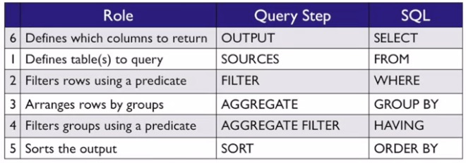

# Week 2 - Data Sources and Data Challenges
## Formulating a Data Query I
* Filtering questions vs joining questions
  * reducing the number of results vs combining different data sources
## Formulating a Data Query II
1. What *sources* are available?
2. Do you want all or some results? (Filtering!)
3. *Aggregate* the data!
4. Filter aggregates!
  * "What is the average height of patients from Baltimore between the ages of 50 and 60"
5. *Sorting* the output
  * Alphabetical? 
6. Output - what do you want to show to others?

## Read World Data Questions
* "Give me a cohort of patients who visited my clinic last month"
* Framework
  * `FROM` - Patients/Visits/Clinic tables, joined with Provider
    * What is considered a visit? Is the table current? Are some patients excluded? Is my clinic represented by a department?
  * `WHERE` - What columns represented a "visit"? VisitDate? AdmittedDate? DischargedDate?
  * `ORDERBY`/`GROUPBY` - alphabetical? chronological?
  * `SELECT` - what columns do you want from the reduced data?
    * What format do you want it in (Excel? CSV? Dashboard?)
## i2b2 Demo
* i2b2 - Informatics for Integrating Biology and the Bedside
  * real, granular, but de-identified
    * Diagnoses, labs, procedures, medications, research studies, genomics