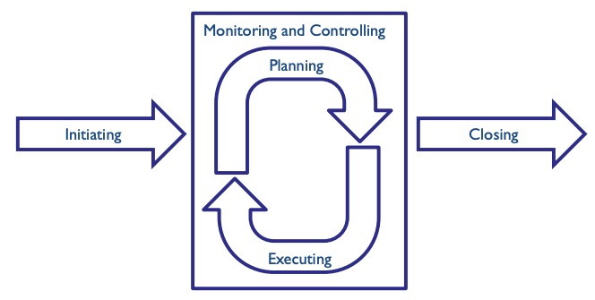
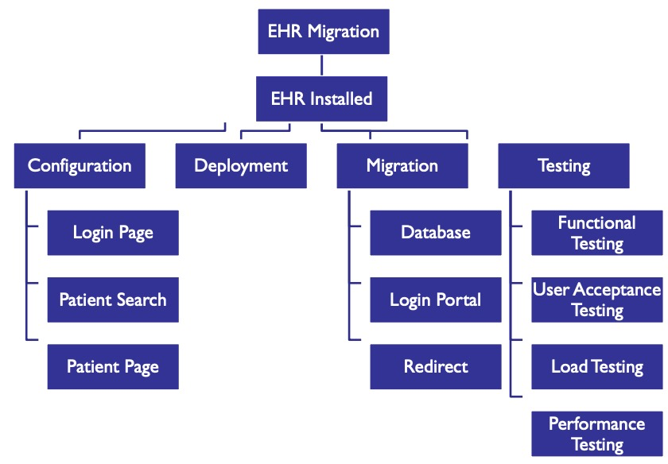
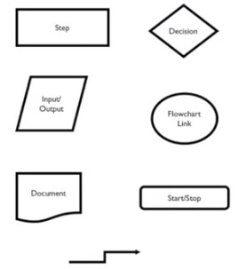

# What is a Project?
* Temporal (has a start and end)
* Results in a new outcome
  * a product or service
  * can be tangible or intangible
    * ie. operational, conceptual
* is distincty from ongoing operations
  * not maintaining something else
* Criteria for Success
  * On time
  * Within budget
  * Quality outcome
# Project Planning
* Five process groups:
  * Initiating
  * Planning
  * Execution
  * Monitoring and Controlling
  * Closing

* Initiating
  * First goal is always to ba build a relationship with stakeholders
    * Get to know each other
    * Determine who brings what to the table
    * Make the process of how we'll go about the project clear to everyone
  * Define the project goals
    * Ensure stakholders and team members are properly engaged
      * Best to include stakeholders as much as possible
      * Include clinicians, nurses, engineers, designers and project managers
  * Iterate on project understanding a few times, over a number of meetings/working sessions
    * Produce an SOW (Statement of Work)
      * helps properly determine the scope of the project
      * Avoid **scope creep**
        * when project scope goes over the original plan
      * Get signatures on the SOW
* Planning
  * Determine and communicate the project members
    * names and roles, including stakeholders
  * Determine and agree on project process
    * how often to communicate
    * how do we unblock blockers
    * how do we update stakeholders on project status
  * Start planning actual work with engineers and designers
    * Design, development, testing deployment
    * Do both low- and high- fidelity mockups
    * Make sure to visit the SOW/scope again after defining phases
      * Adding details can have an impact on the scope
    * Create a project plan (Gantt chart, project roadmap, etc.)
      * something to be shared with stakeholders and project team together
* Executing
  * Define detailed project requirements
    * acceptance criteria
    * use case documents
    * functional requirement documents
  * full UI/UX mockups (low- and high-fidelity)
    * it's cheap to iterate on mockups over software
    * get all the elements right
  * Once that's complete, start the software development process
    * Waterfall, kanban, agile
* Monitoring and controlling
  * Not just after it's done, but also during development
  * Keep your stakeholders up-to-date
    * screenshots, project maps, demos
  * Are we still on track? on budget?
  * What are our risks?
  * Helps you identify key assumptions and whether or not they may work
  * Have metrics and KPIs
    * Team defines them together
    * Productivity, progress, budget, etc.
* Closing
  * During and post-deployment, helpful to look at *lessons learned*
  * Useful place to engage stakeholders
    * What went well
    * What could've gone better
    * How do we get better?
## Tools of the Trade
# Role of the Work Breakdown Structure in Heath IT

* Work Breakdown Structure
* What it is
  * Deliverable-oriented hierachy of the work required by the project team
    * Project Management work
    * Product
    * Product Scope
  * Includes internal and external deliverables
  * aids in scope management
* What can go with a poor WBS
  * Project re-plans and extensions
  * lack of clarity/responsibility
  * scope creep
  * mismanaging budget
  * missed deadlines
  * unusable products or delivered features
* Not everything can benefit from an WBS
# Process Flow Charts, Standard Symbols
* Process Flow Chart
  * visual representation of a process that shows the start and end, the required steps and the other of these steps 
  * can be high- or low-level
    * high-level for executive presentations
    * low-level for sharing with your team
* Standard Symbols
  * Shapes... and words...

# Gantt Charts
* What it is
  * Scheduling tool
  * originally intended for use with waterfall
  * can be used to:
    * assess length of a project
    * determine necessary project resources
    * allows you to plan order of task completion
    * manage dependencies between tasks (A must be done before B)
    * inform stakeholders of progress
* How to create
  * Identify essential tasks
  * Identify task relationships
    * Sequential or parallel
* Common pitfalls
  * Not updating it regularly
  * not adding in buffer
  * being too detailed
  * key dates are not highlighted well
  * tasks performed too early
  * not factoring in other projects the team is working on
  * too many people involved