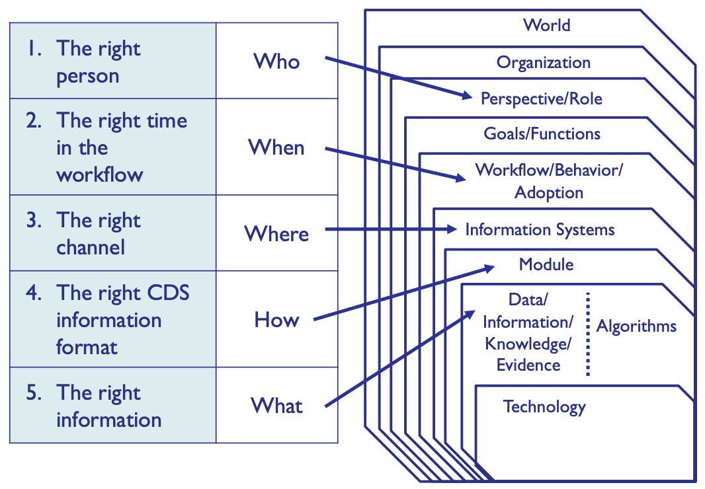
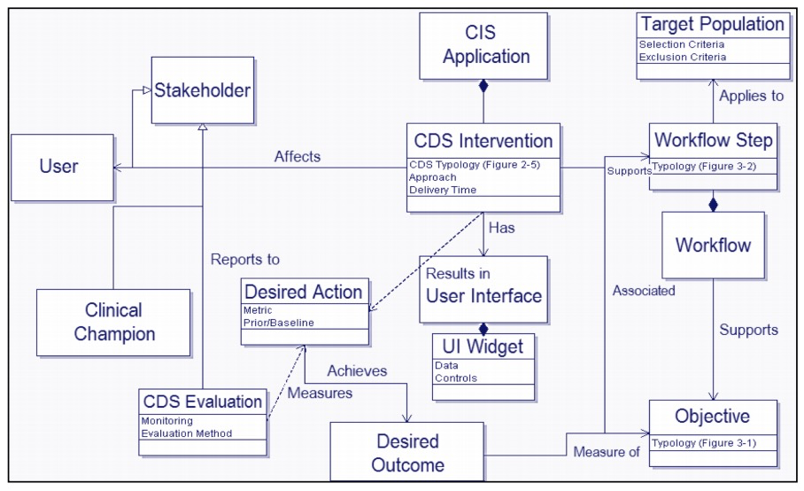

# Key Concepts
* List the types of decision support used in healthcare informatics
* Describe the outcomes that are targeted and how to choose them
* Explain the importance of workflow in decision support
* Describe a framework to ensure a complete decision support intervention
# Knowing Where to Intervene
## Motivation: Examples
* Questions to ask:
  * Who has the decision?
  * What is the decision?
  * Does the screen match the decision?
### Hard Stop Decision Support
* "Do you want to save changes?" popup
* Can't continue unless you response to *
* Questions:
  * Who: User
  * What: Retain file or not
  * Match?: Yes
### Poster on Clinic Walls
* A poster can be decision support/intervention as much as a computer system
* Questions:
  * Who: Clinical staff
  * What: Triage/Treat
  * Match?: Yes
### SMART-on-FHIR Apps
* Chest pain and EKG data
  * Questions:
    * Who: Triager
    * What: Triage (too little info for diagnosis)
    * Match?: Depends on what you want to do
* Bilirubin app
  * Who: Pediatrician
  * What: To do a blood transfusion, bili lights, or nothing
  * Match?: Depends on context
### EHR Pop-ups
* Medication allergy pop-ups
  * Who: Ordering clinician
  * What: Change dose, drug, or stick with the order
  * Match?: What does clicking "OK" mean?
### Population Health Dashboards
* Vaccination Bar Charts
  * Who: Care Manager
  * What: Which patients to focus on
  * Match?: If you can "drill down"
    * if you could see the individual patients
* Diabetes Map
  * Who: Public health officer
  * What: Where to allocate diabetes efforts and resources
  * Match?: Missing financial implications (costs, effects)
### Motivation
* Goal is to make better decisions through better data/information
* Different types of decision support:
  * Clinical
  * Shared (patient and provider are both involved)
  * Administrative/Management
  * Public Health
### 5 Right of CDS
1. Right information - evidence-based, suitable, pertinent
2. Right person - member of the care team
3. Right form - alert, order set, reference information
4. Right channel - Clinical information system (CIS), EMR?, PHR?, internet?
5. Right time - in the workflow, at a time of decision, action or need

### Outline
* Should you build it or buy it?
* Does it work?
* Is it used?
* Does it accomplish your goals?
* How to build it?
## Should You?
### Build or Buy it?
* Preceding question is "Do we even need it?"
  * Look at the benefits and costs
  * Gap between *as is* and *to be*
  * mortality/morbidity/out of pocket cost
#### Benefits for the Clinician
* Higher quality/safer care - better professionalism
* Better workflow - efficiency, reduced time, more time with patients
* Better metrics - better quality scores, better reimbursement
* drug allergy - quicker ordering, fewer "never" events
#### Benefits for the Organization
* Higher quality/safer care
* Higher regulatory compliance
* Lower liability
* Drug allergies, once again
### Costs: Build vs. Buy
* Difficulty in:
  * Development/purchase
    * Don't just think about the upfront costs, think about the TCO
  * Deployment
  * Maintenance
* False negatives
  * missed cases
* False positives
  * Alert fatigue
### Decision Analysis Trees
* Decision trees, amiright....
* Follow the trees with money/Cost-benefit/Cost-effectiveness or patients saved
## Should You?? II: HIMSS framework
* Your IT people should not be in charge of decision support
  * Alienates your clinicians
* Clinical owner vs champions
  * owner is the person that the IT people go to to ask questions
  * champion is who rallies up support amongst other clinicians
* Widgets - UIs
* Implicit knowledge vs Explicit knowledge
  * explicit - hard stops and pop ups, suggestions, thresholds
  * implicit - "this is the data to look at," without giving suggestions, ie. EKGs

## Does It Work?: Testing
* Not software testing, but project testing
  * Is this improving outcomes for patients?
* Three levels of testing:
  * In lab
  * Silently
  * In practice
* In Lab Testing
  * 2^n permutations for chaining ANDs together
* Silently
  * Alerts fire internally, not visible to the user
  * Lets you see how it would have behaved
  * Review the cases and judge true and false positives/negatives
  * Tweak the rule until silent mode is working
* Trade offs
  * How many false positives is it worth to prevent false negatives
  * False negatives are the absolute worst
  * But too many false positives may result in high override rates in other CDS alarms
* In Practice
  * Review firing early
  * Review on an ongoing basis
  * Ideally: Dashboard for rule analytics
    * number of firings, number of overrides, number of false positives/negatives
## Is It Used? Does It Accomplish Goals?
* Questions
  * Do they see/respond to it enough?
  * Do they respond in the way that you want them to?
  * What are thresholds (what is **enough**?)
* Workflow Misalignment
  * You gotta send the alert not too early or not too late
  * It's one of the Rights!!
* Workflow interruption
  * steps that ruin or break the workflow
* Usability human factors to look into when planning CDS
  * Alarm philosophy
  * Placement
  * Prioritization
  * Color
  * Learnability and confusability
    * Can a user easily learn how to use it or get confused by it?
  * Does the text alert possess four specific components?
  * Proximity of task components being displayed
  * Corrective actions
* Effectiveness
  * Only 2/3s of studies have an impact
    * and by the order of 10-20%!
    * with 1/3 in improvement of treatment
  * mainly individual stories/anecdotes
* Attributes that conferred success
  * automatic prompting to use the system
  * use of "home-grown" very customized solutions
    * able to decrease false positives and negatives together
  * advice is automatically brought into the clinicians' workflow
  * clear recommendations