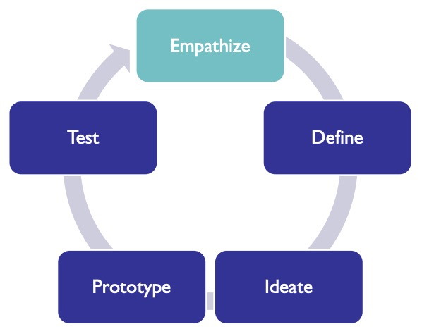
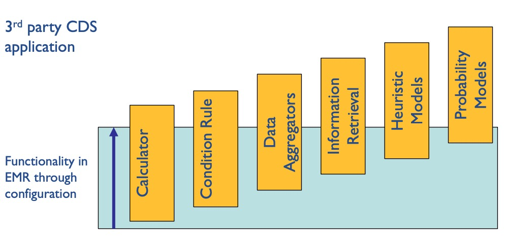

# Week 2 - Defining Decision Support
## Key Concepts
* Explain the concept of "re-imagining work"
* List types of decision Support
* Describe the steps of the design thinking process
* Examine a usability framework
## Defining Decision Support
### Clinical Decision Support
#### "Dawn of Computer Age in Healthcare"
* From 2008 to 2018, went from 10% to >90% adoption of EMRs
* Similar to other industries, this initially makes workforces less productive
* This will be resolve in the next 10-20 years by:
  * Continued technology improvements
  * Re-imagining work
#### What Does Re-imagining Work Mean?
* Re-inventing the clinic visit using telemedicine for virtual patient visits
* Using voice-enabled technology to assist clinical documentation
* Using wearables to collect diagnostic data at home and in inpatient settings
* Helping providers collaborate on coordinating care
* Decision support tools for providers and patients
### Types of Clinical Decision Support
#### What is Clinical Decision Support?
* "CDS encompasses a variety of approaches to provide clinicians, staff, patients and other concerned individuals with timely, relevant information that can improve decision making, prevent errors, and enhance health and health care."
  * Definition from AMIA
#### CDS Goals
* *Clinical Decision Support: The Road to Broad Adoption, 2nd Edition*, allegedly a great book
* Aid in making clinical decisions
  * Choice of Test
    * deduced via signs and symptoms
  * Choice of treatment
  * Confirmation of Diagnosis
  * Measure Prognosis
* Answering questions
  * Finding literature or clinical trials
* Monitoring actions
  * medication allergy notifications
* Focusing attention
  * data visualization of prognosis, diagnosis, improving/declining
#### Types of CDS
* Calculators
  * Can be as straightforward as BMI
  * Important to tie the units to a terminology for consistent meaning
* Logical Conditions
  * Rules, If Then statements
  * ex. Allergy notifications
* Data aggregators
  * Groupings of relevant information
  * ex. combining time series data for a patient
* Information retrieval
  * ex. PubMed, peer reviewed literature
  * search tools
  * EMR searches
* Heuristic models
  * built by providers on how care is given today
  * clinical guidelines, constructed by clinical societies
    * based off signs and symptoms
* Probabilistic Models
  * application of machine learning
  * based on understanding a patient's risk for disease
  * Bayes Theorems, prevelance of risk
### Design Phase
* Figuring out which type of CDS is a hard question
#### Prostate Cancer
* 180,000 mean are diagnosed with prostate cancer every year in the Using
* 29% of cancers are indolent tumors that do not require surgery
* Majority of men with a favorable prognosis still opt for surgical removal of radiation at a cost of 30k per procedure
  * surgery has potential urinary, bowel or sexual side effects
* Equates to 40,000 unnecessary procedures each year at a cost of $1.2b/year
###### Prostate Active Surveillance Decision Support
* Drs. Bal Carter and Kenneth Pienta
* Started tracking patients in 1995
* Over 1,600 patients
* Drs. Scott Zeger and Yates Coley built a Bayesian model to estimate
  * underlying risk of disease
  * estimate of treatment effects
#### Design Thinking Process

##### Empathy
1. Seek to understand the problem
  1. Be non-judgemental to truly understand what is happening now
2. Observation
  1. Understand workflow and human interactions (clinical care is highly collaborative)
  2. Formulate questions
3. Interview users
  1. One on One
  2. Focus groups
  3. Surveys
* Understand how people behave, not how you *wish* they would behave  
###### Work Systems
* Technology and Tools
  * Mobile, workstation, web-based, device-oriented
  * *Clinical workstation, EMR*
* Person
  * Technologist, nurse, physician, resident, attending
  * Technical proficiency, frequency of use
  * *Urologist, Patient*
* Task
  * Order tests, prescribe medications, perform procedure
  * *Review results, evaluate options*
* Environment
  * Sterile operating room, remote telemedicine setting
  * *Clinic outpatient setting*
* Organization
  * Academic medical center, rural private practice
  * *Academic medical center*
### Define Phase
#### Problem (Case Study)
* Design a tool to help men understand their underlying risk of developing a more aggressive cancer
* Should they have a biopsy?
* Should they have surgery?
#### Define
* Defining requirements and the problem
* Not a linear path, not meant to be sequential
### Ideate Phase
* Presenting ideas
  * What are we missing?
* Cast a wiide net soliciting feedback
* Literature review
* Market analysis
* Prioritization
### Prototype Phase
### Test Phase
### Deploy Phase
* Not just deploying to production
* How do you deploy it into an *HCP's workflow*?
#### Spectrum of Build, Buy and Configure (your EMR)
