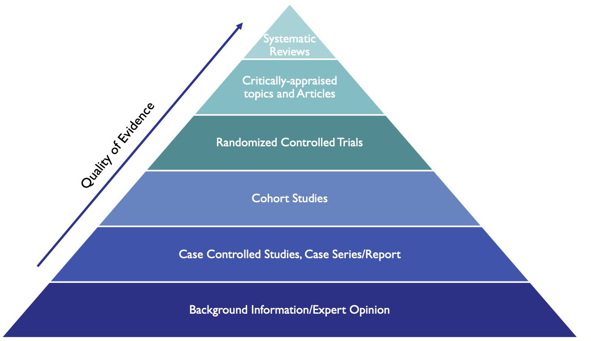

# Week 4 - Eliciting and Creating Knowledge for Decision Support
## Key Concepts
* Describe how knowledge may be elicited from experts
* Describe how knowledge may be gleaned from literature
* Describe how knowledge may be generated from EHR data
* Identify appropriate uses of System 1 and System 2 decision making
## Knowledge and Decision Support
* Three sources of knowledge can make up a knowledge base
  * Expert knowledge
  * Scientific literature
  * Enterprise data warehouse
## Expert Knowledge
* It's not as simple as asking a clinician what they need
### Elicitation
### What Expert Knowledge Do You Need?
* Medical Domain?
* Workflow?
* Management?
* Trade offs?
### Types of Knowledge
* Knowledge of _what_
  * System 1: "Fast and Frugal"
  * System 2: "Slow and tortured"
* Knowledge of _how_
#### System 1: Implicit
* Biases
* Heuristics
* Pattern recognition
* Adaptive toolbox
* Emotional
* Political/social
* Gist/verbatim
#### System 2: Rationcination
* Ex. Decision Trees
* Ex. Rules
* You: perspective
* SHOULDT
  * Structure/causal
  * Context
  * Outcomes
  * Uncertainties/probabilities
  * List of actions
  * Desires/values/trade offs/threshold
  * Time Horizon
## Decision Support Committee
* Why - can help create the knowledge base of expert knowledge, scientific literature, and enterprise data warehouses
* Great and essential for answering the "meta" questions
  * Why do we need this?
## Eliciting Expert Knowledge
### Elicitation
* Similar to requirements elicitation
* Qualitative methods
  * observations, artifacts
  * Member checking
* "Modified Delphi"
  * Consensus
    * **Get their opinions/perspectives separately from the rest of the group**
      * Prevent groupthink
    * If there's a disagreement, you can start asking good questions
      * "Why did the estimate change?"
  * Best: Secret (distributed) ballot
  * Best: sign-off on estimates
* Both System 1 & System 2
### Elicitation Methods
* Mode
  * Individual Interview
  * Group Interview (focus group)
  * Survey (paper, machine)
* Methods
  * Open-ended
  * Scenario-based (with talk-aloud)
  * Quantitative elicitation
#### Computer-based elicitation
* Similar to methods in needs assessment
* Results are more granular
* Cognitive task analysis
### Qualitative Analysis
* What are the ontological concepts that are mentioned?
  * How do we derive themes from the words that have been said?
* Grounded theory - thematic analysis (bottom-up)
  * Like upper-level ontology
  * Dimensions, key features
  * Quantitative concern: saturation
* Theory-driven: prior knowledge (top-down)
### Saturation
* When you run out new data/concepts after interviewing multiple people
  * But are you actually saturated?
    * Talk to the clinicians, and the nurses, and the pharmacists
    * See if you care about the whole system
## The Literature

### Evidence-Based Medicine (EBM)
1. Define question
  * How do i manage type 2 diabetes after diet has failed?
    * P: patient
    * I: intervention (beyond diet)
    * C: comparator (diet)
    * O: outcome (left unspecified)
    * T: Time scale (left unspecified)
2. Decide on reference database(s) to search
  * Article - PubMed
  * Cited References - Google Scholar
3. Perform search
4. Look over titles and abstracts
5. Done?
6. Read articles
7. Answer question
## Data -- Knowledge
### Data Quality Issues
* Noise - rounding errors, typing errors, transcription errors, etc.
* Non-normalized data - different units, different coding systems, etc.
* Missing data - in most industries, you can extrapolate (impute is the proper term) fake data, but you can't do that with EHR data!
  * Reasons why: patient could be dead!
    * Patient feels better so they don't come in anymore
    * Patient went to another institution
    * Doctor didn't examine that part/didn't record it
### Feature Selection/Extraction
* So much data; what do you focus on?
## Statistical Methods
* just your standard overview of what different methods there are
## AI Dangers
* Biased input
* Wrong input
* Models are often very opaque, black box
## Summary

