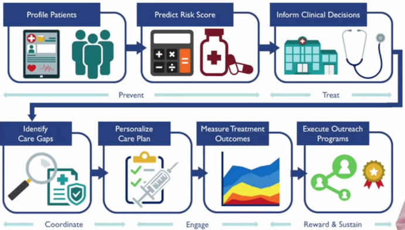
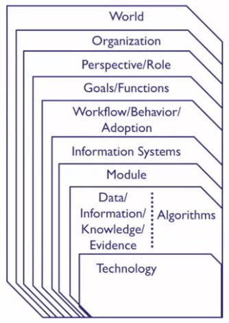

[Link to Week 1 content](https://www.coursera.org/learn/the-socio-technical-health-informatics-context/home/week/1)
# Key Concepts
* Give examples of healthcare informatics problems
* Explain the need for a social approach to healthcare informatics problems
* Explain the need for a technical approach to healthcare informatics problems
# Health Information Technology For Patients
* Patient-entered data (such as filled out forms, questionnaires, home-reported data) could be inaccurate
* Patient Reported Outcome Forms
  * "How do you feel? Are you depressed? Are you able to walk? How is your sleep?"
  * Can have "skip logic" and only ask you questions relevant to you/based off of the previously answered questions
    * Think Lyra's care form
* Patient Portals
  * Variety of Information
    * appointments, lab results, testing, secure messaging, patient record
  * How does medical care change when a patient can see everything?
    * Are notes more honest? They're better, but are they more honest too?
* Digital Medical Devices
  * Clinicians and patients are on the same page when being used
  * "Did you hear/see that?"
* Wearables, Devices, IoT
  * Fitness tracker
  * Heart rate monitors
  * Contact lenses that measure glucose levels via the eye
  * Continuous data issues
    * Example: Blood pressure
      * Blood pressure science is entirely based on infrequent measurements done in offices
      * How does medication/treatment change if you can continuously measure blood pressure at home?
# Health Information Technology for Doctors
* Front Sheet (Summary Form)
  * A screen that summarizes where the patient is today
  * Much more complicated screens than what patients see
  * Most important problems in the top left, least important in bottom right
  * Typical older adult has ~9 medical problems
  * Allergies
  * Medications
  * Decision Support panels
    * reminders, alerts, etc.
  * Recent labs
  * Tabs - to follow through with the metaphor from back in the paper days
    * Cars are horseless carriages!
* Web Metaphor
  * Cleaner, more dynamic and visual
* Graphics
  * Charts, graphs
  * Could also show you where the danger zones "red regions" are
  * great for time series data
* Computerized Provider Order Entry (CPOE) with Decision Support
  * Forms that clinicians use to order labs, tests or prescribe medication
  * Can have modals or other alerts to trigger for decision support purposes
    * Show the logic _why_ and along with possible actions
    * 90% of alerts are ignored
* Meaningful use is to take the EHRs that clinicians were forced to adopt and drive value out of them
# Populations
* Population Health Management

* Much cheaper to keep people healthy than it is to take care of them when sick
* Public Health Systems
  * Healthcare is more about than just the healthcare system a clinician sees them in
  * often in silos
    * lack of interaction and interoperability
* Learning Health Systems
  * Clinical care is an ongoing scientific experiment
  * Internal and External scan, Design, Implement, Evaluate, Adjust, Share with external parties
# Imperatives
* Why is Health Informatics important?
* Quality, Safety, Cost, and Technology
## Quality
* Use has poor life expectancy relative to how much it spends per capita
* Health care can be improved by technology
## Safety
* If quality is making sure you get the best care, safety is making sure you don't get the worst care
* Errors of Commission - Accidents, typically
  * Given the wrong blood, wrong dosage
* Errors of Thought - often not written down
  * 5% of adults experience it in inpatient care
  * contributes to 10% of deaths
  * 6 to 17% of hospital adverse events
  * 2x as many malpractice claims
* Ishikawa (Fishbone) Diagram
  * Root Cause Analysis - why did the patient die
  * list out of causes
* Don't make bad choices available
## Cost
* Health informatics can help drive down cost
* "All IT causes harm", "It's all about the money"
* 1/5 of our economy is in healthcare
* Federal Objectives: MACRA
  * Quality, resource use, clinical improvement activities, advancing care information
## Technology
* Interest in technology-driven ecosystems is growing
* Technology is driving its own ecology
* Help drive patient engagement UP
  * e-patient Dave
* Patients want more data, clinicians don't want to give it
  * Clinicians don't trust patients
    * Could drive up costs by pushing for therapies
* Blockchain is cool
# Definitions
* Health IT - Applicatioin of computers and infomration technology in healthcare settings
* Health Information Management (HIM) - Operations still demand continued focus on day-to-day activities like EHR implementation, coding, revenue cycle, prvacy and security, and release of information (ROI), to name a few
  * work and people that manage the daily ingest and uptake of clinical data
* Informatics - scientific discipline
  * Learning health systems!
  * Learning from the environment
  * Collection, storage, retrieval and communcation of the data
  * It's a people-based role; problems come from stakeholders, not technical details
* Multiple domains of informatics
  * Bioinformatics, imaging informatics, clinical informatics, or public health informatics
  * Biomedical Informatics != Health Informatics
* IT is on the technology, informatics is about data and knowledge
  * Health IT is what you can do; Health Informatics is what you *should* do
* Informatics is a socio-technical discipline
  * Not about the technology, it's about the people
# The Stack
* how technical and social knowledge can be combined
* mental framework for how to social and technical problems can be combined, linked together, or separated

* Top half of the stack is what is trying to be solved, the bottom half is how it can be solved
* Informaticists live at the line between what and how
* Useful in conversations and discussions
* Is the person you're talking to below the line (How/Technical folks) or above the line (What/clinical folks)
  * If a clinician asks for a database, ask yourself if that's what they *really* meant or need