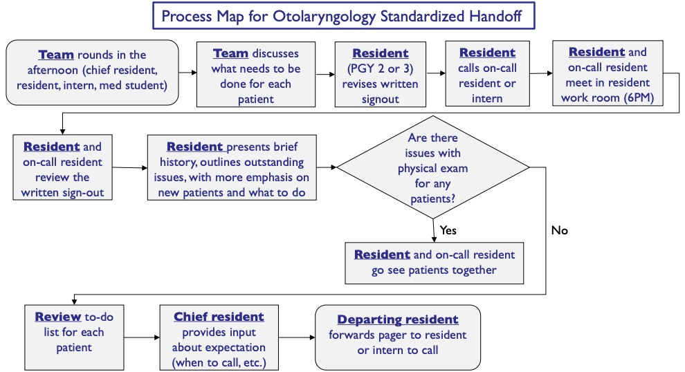
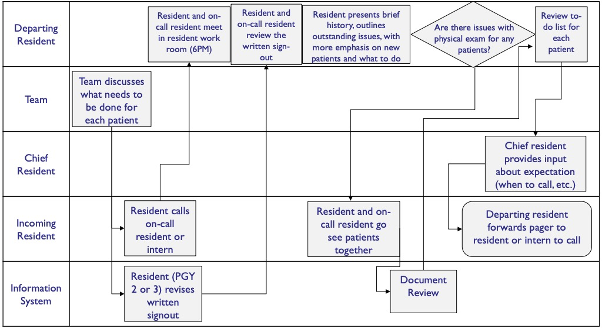

[Link to Week 3 content](https://www.coursera.org/learn/the-socio-technical-health-informatics-context/home/week/3)
# Key Concepts
* Explain the differences among Needs, Requirements, and Specifications
* Describe the methods of depicting workflow.
* Describe three general architectures used in health IT
* List example modules of health IT information systems
* List key steps in software development
* Describe ways in which health IT harms user workflow
* Explain how text data is exchanged in health IT systems using HL7
# Need and System Specification
* Needs are what people have (Perspectives/Roles)
* Requirements are what we want the system to accomplish (Workflow/Behavior/Adoption)
* Specification is how we build the system to accomplish those goals (Modules)
* Example
  * Need: Providers need to see the diagnoses when they order medications
  * Requirement: CPOE module shall display problem-list diagnoses during ordering process
  * Specification: Screens shall display fields in a textbox at the top of the screen
  * As you work down the stack, you get more detailed
  * Decisions shouldn't be made by just one perspective
* Need -> Requirement: Contending Forces
  * the client is an expert
  * but people don't know what they want until you show it to them
* The process of getting from Needs to Requirements:
  * requires System Analysts: people with people skills that can talk both domain and technology
  * interviews, role playing, use cases, storyboard, prototypes
  * Scope creep: "shall, should, could, wouldn't it be nice if"
    * you gotta figure out when to draw the line
    * "Well if you want to add this, it's going to cost this much"
* Need -> Specification:
* Theories of Information Use
  * Least Effort: Don't Make Me Think
    * Shouldn't have to show instructions on how to use
  * Berry Picking: Exploratory Search
    * When you don't know what to do, let them explore and bookmark for later viewing
  * Sense Making: Building a Mental Model
    * Build a mental model so you can make sense of the UX
* Theories of Decision Making
  * Flow diagrams
  * Dual Process Theory
    * Fast & Frugal - heuristics of *system one thinking* - being able to pick up that red is bad, green is good, following existing metaphors quickly
    * Slow & Tortuous - modeling, data modeling, data collection - things you should hide behind the scenes
    * Hiding the slow and tortuous behind the fast and frugal is the way we want CDS to work
  * Transtheoretical Model - five steps
    * Precontemplation - context and statement making
    * Contemplation - "okay, i'm interested, what more can you tell me"
    * Preparation - "okay, I'm committed to doing something"
    * Action - "Okay, I will do something"
    * Maintenance - to maintain
    * Recidivism - to get re-motivated, often system one thinking
  * Social Cognitive Theory: self efficacy
  # Articulating Workflow
  * Draw flowcharts
  * Important for clients
  * Essential tool for communication, rather than something to generate software out of
  * Important to know *who* is working at each step of the workflow
  * Once you convert it to who, you can generate swimlanes
  
  * How are they involved
  
  * Once divided into swim lanes, it's easier to see where the problems are, who needs helps, or where the gaps are
# Information System Architecture
* Functional Definitions
  * Module: a component of a system that performs a self-contained function
    * A module can also be a system
  * System: lots of modules (system of systems)
* CDS Hooks and FHIR are modules to communicate between EHRs and apps
* IHE (Integrating the Healthcare Enterprise)
* they use APIs...
* Systems are modules or modules are systems based on which 4P perspective you're looking through
# Modules Comprising Clinical Information Systems
* Lots of examples dashboards - Administrative or clinical
  * CDS, care management, HIS 
  * Dictation/transcription
  * EHR/EMR
  * PACS, LIS, Financial Management, HIE, Enterprise imaging
  * MIPS, Mobile App, Pharmacy, Medication Management
# Developing Software
* Do you build it or buy it?
  * Can you afford to buy something off the shelf and doesn't do everything you need?
  * Or can you afford to invest time and money and resources into building a bespoke system?
* Request for Proposal (RFP)
* Use cases -> at the level of specification
* Avoid salespeople; talk to clinicians or the IT folks
* You are buying a relationship, not a program
* Testing vs. Evaluation
  * Testing - does it work
  * Evaluation - does it accomplish the goal that you bought it for in the first place
* ~ A G I L E ~
# Harming Workflow
* Vast majority is harm by IT screwing up the workflow
* "Death by a thousand clicks"
  * "Dumbing down medicine too much for experts"
  * "Why do they make me lie to get through my day?"
  * All types of HCPs are unhappy: 70%+
* Alert fatigue
* Areas of Usability Problems
  * Screen display problems (incomplete, mutiple, confusing labels)
  * Drop down menus - mis-selection; similar names; order placement; time delay
  * Wording - misinterpretation; trailing zeros
  * Default settings - don't change; don't track user; hidden corollary orders
  * Non-intuitive ordering - non-standardized terminology; bad interoperability
  * Repeat Rx - repeats previously un-corrected information that has been corrected
  * DS issue - user doesn't know; inconsistent; erroneous recommendations
  * Can't batch activity - has to do one at a time
  * Doesn't catch user using someone else's session
* Human factors and user-centered design