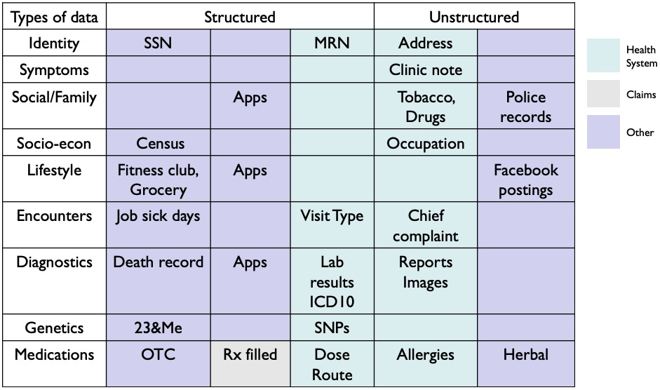

# Key Concepts
* Characterize differences between data and information
* Characterize differences between information and knowledge
* Identify concerns regarding data exchange
* Describe standards for data exchange
* Identify a technology's location on the hype cycle
* Identify a career in IT/informatics you would want
# Introduction: Data, Information and Knowledge
* Informatics - scientific discpline that deals with the collection, storage, retrieval, communication and use of data, information and knowledge
* DIKW - data, information, knowledge, wisdom
* Hierarchy
  * Data - raw
  * Information - Who, what, when, where
  * Knowledge - why, how

# Many Types of Clinical Data
* Covers actual EHR data, claims data, and other data
* Structured vs unstructured data
  * Many different types (identify, medication, lifestyle) can come unstructured of Structured

* A typical form can have a combination of different types, structures of data

* Atomic values refer to discrete or categorical values
  * Things that can't be broken down any further
  * Name, not atomic -> first name, middle name, last name, suffix,
  * blood pressure -> atomic
* Most import structured datum is the **ID**
  * One ID for one entity
  * Patient ID, Visit ID, Specimen ID, Facility ID, Concept ID, OMOP ID, UUID,
  * SSN is not an ID
    * Illegal to use SSN as an ID
* Closed World Assumption - what exists in the database is entirely it
* ICU helevac example - mortality increases because time is spent having to create the Patient in the EHR before assigning them treatments
* 80% of clinical information exists within unstructured clinical notes
* Allergies aren't simple
  * type of allergy, reaction, etc.
* Images are unstructured data
* Other types of data
  * Police records, census tracking data, facebook posts, alternative medicines
  * Credit card history, purchase history, etc.
  * think House and every other forensic drama relating to 
* Population health data
  * Social determinants
  * income, education, physical activity, diet, etc
  * location data
  * Patient-entered data
# Information
* Information - meaning behind the data
* Information is organized
  * you don't have to think too much
* Comparisons/Reference Ranges are information
* Information can be derived from the knowledge of norms
* Not telling you what to do with the data, but rather what the data means relative to something or everything else
* Individual vs population information
* Metadata - additional data that helps enrich or inform about other data
# Knowledge
* Applying data and information
* Predictive analytics is a type of knowledge
  * creating a formula to predict risk or likelihood for a patient
* Active Advice - parsing data and providing suggestions or alerts
* Image recognition
# Data Exchange
* Anemia vs Anaemia
  * interoperability is hard
  * they mean the same thing, but computers can't tell that without Metadata
* Sodium, NA, NA+, Sod, Sodium Chloride, NaCl
  * Use LOINC codes
    * At least 5 ways of saying sodium
* 80% of a technologist's role in labs/research is having conversations with researchers about what the code should be
  * "Which do you really want?"
* Diagnoses uses ICD-10
  * ICD-10-CM (clinical modification) - made by the CDC and AMA
* CPT for billing, HCPS and HCPS Levels 1 and 2
* Text processing sometimes work, but it fails once negation is possible, and thus NLP is the only recourse
* Data Quality
  * Quality can be defined by how much metadata is attached to it
    * Patient, parameter, value, time, method
  * Conformance and completeness
    * Does it have all the required fields and is consistent?
  * Plausibility
  * Validation
  * Verification
# Interoperability Revisited: Text Data
* HL7 is the catch-all text transfer system
* CDA (Clinical Document Architecture) is for documents
* FHIR is an extension of HL7 that comes with schemas and structures for sending a variety of different data types
* Even using the same version of HL7 might not work properly
# Interoperability: Images
* Imaging informatics is a huge area
* DICOM - Digital Imaging Communication of Medicine
  * no need for proprietary monitors
# Making It Work Together
* How you orchestrate all this together
* IHE - Integrating the Healthcare Enterprise
  * Stemmed from DICOM
* Example: Vaccines
  * Patient record needs to get updated, vaccine supplier gets supply chain updated, CDC gets updated with report
* Integration Profile
  * Schema that defines for what's expected, the use case, and choreography
# Hype Cycle
* Gartner Hype Cycles
* Smart Cities hype cycle is worth looking at due to its connections to social determinants of health
# Careers
* jobs in hospitals and HCPs
* consultancies
* health information exchanges
* HIEs - health information exchanges
* universities