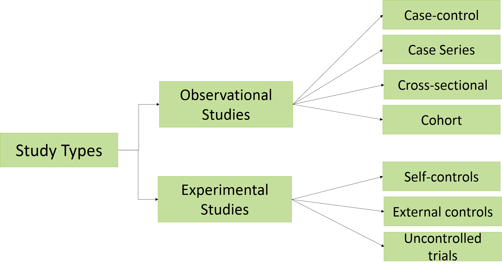

* [Link to Week 1 content](https://www.coursera.org/learn/clinical-research/home/week/1)
# What are the different clinical study types?
* Key Concepts:
  * Observational vs Experimental studies
  * Observational
    * Case studies
    * Case-control studies
    * Cross-sectional studies
    * Cohort studies
  * Experimental
  * Meta-analysis and systematic review
## Observing and Intervening: Observational & Experimental Studies
* Two main types of research: **Observational studies** and **experimental studies/trials**
* Observational
  * maintaining the status quo
  * subjects and *variables* are observed
  * no treatment or intervention
  * day-to-day results/data
    * capturing and analyzing this data
  * Types
    * Case - data on a single group and describe the set (of patients, etc.)
    * Case-control - data on two groups, control and a group to analyze
    * Cross-sectional - ex. surveys
    * Cohort - following a group of people over a period of time
* Experimental studies
  * try something new, and analyze the results of this produced data
    * requires a pre-designated plan
    * healthcare works must change their existing routine and follow the plan based on study design
  * typically involves at least two groups with different paths
  * "the main idea behind an experimental study is to remove bias"
    * this is a little blurry to me, but hopefully I'll figure it out
  * if it involves people, it's a **clinical trial**
  * Ways to augment an experiment
    * Controls - control group, placebo/sham
    * blinding - patient/observers - what treatment is received
    * randomization
  * Types
    * Independant concurrent controls
    * Trials with self-controls
    * Trials with external controls
    * Uncontrolled trials
* Meta-analysis + Systematic reviews
  * super important in the current world for doing research on/with existing research
  * Meta-analysis
    * use pre-existing research and combines their results to an obtain and overall conlusions
    * aims to overcome a very common problem -  **small sample sizes** - which led to *underpowered* results
    * a part of a systematic review
  * Systematic review
    * literature review that sums up the best available on a specific research question
    * includes research results, published guidelines, expert (group) opinion and **meta-analyses**

## Case Studies
